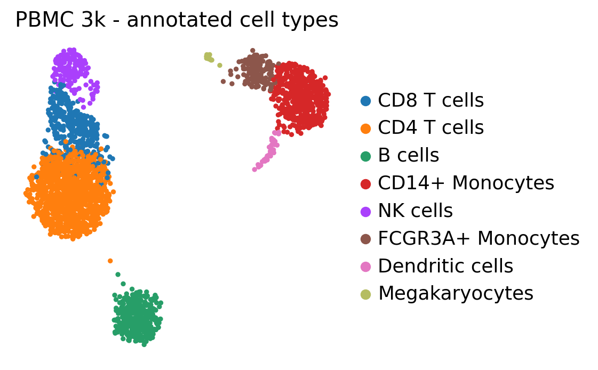
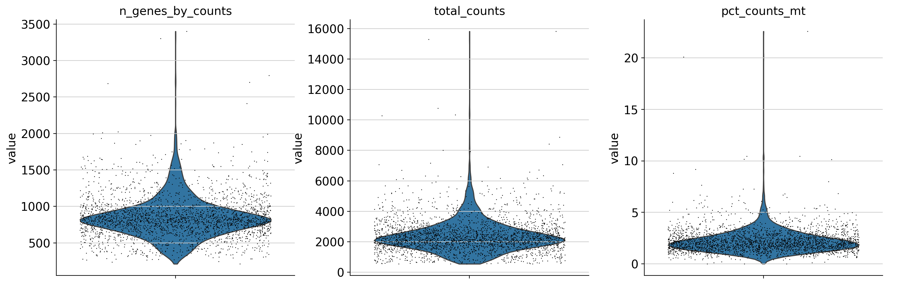
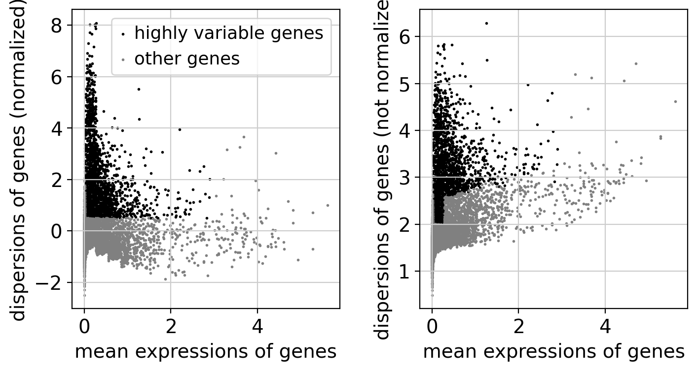
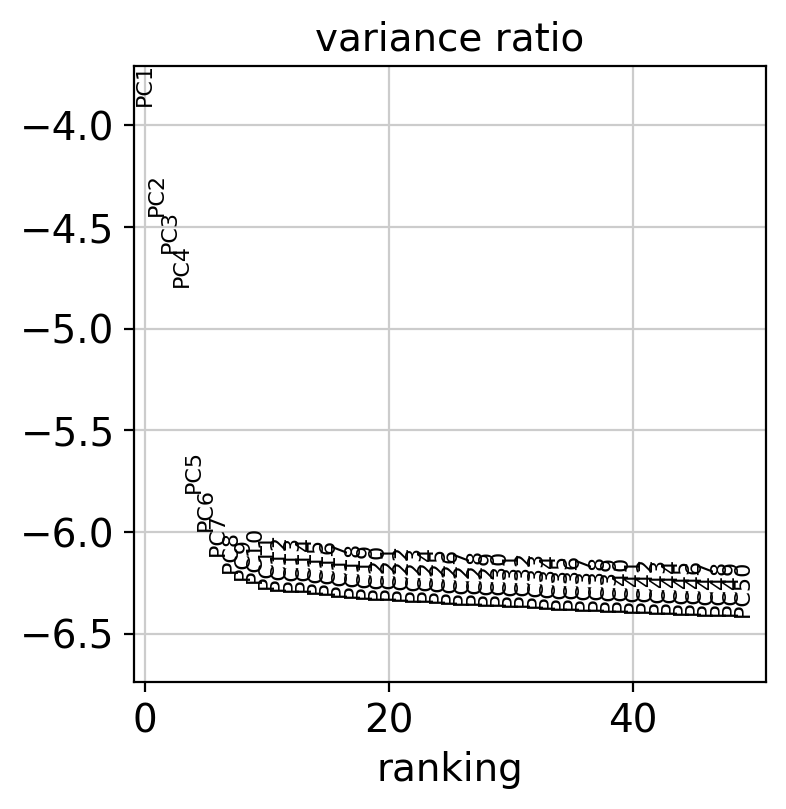
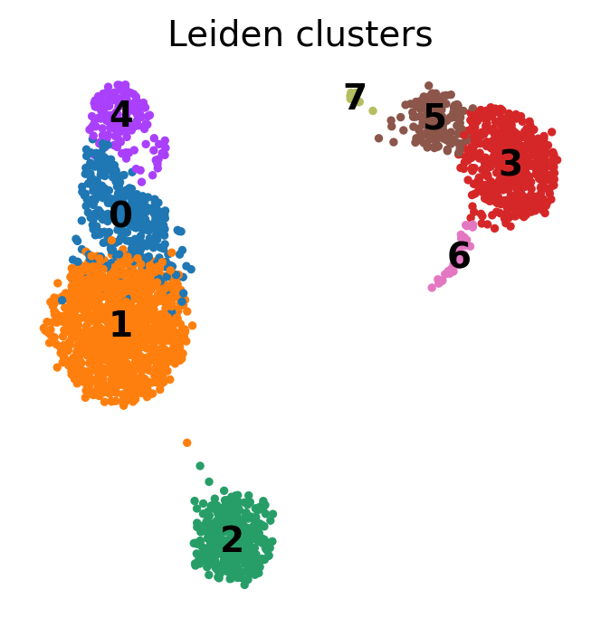
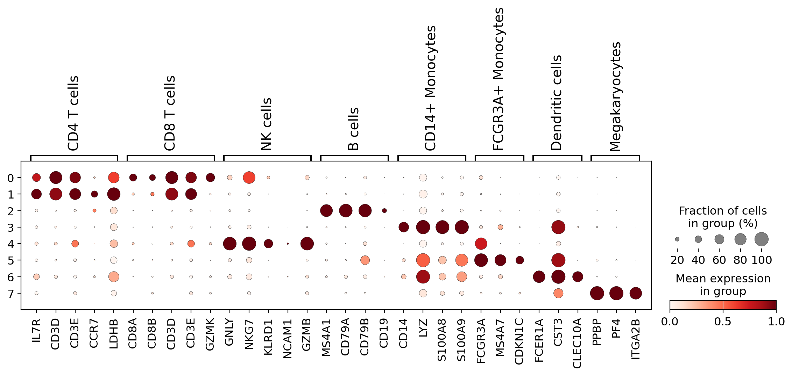
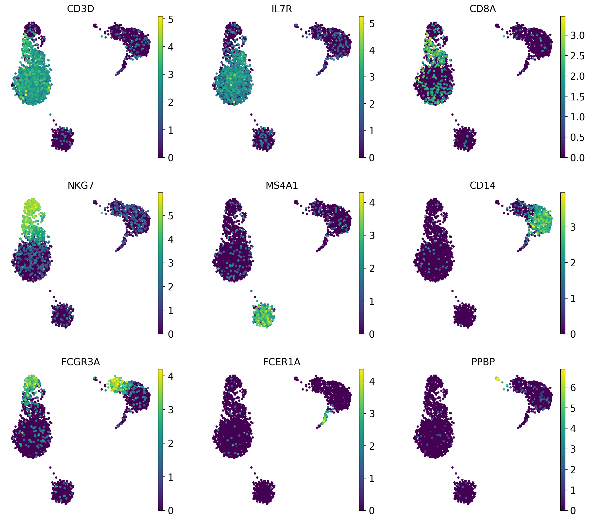
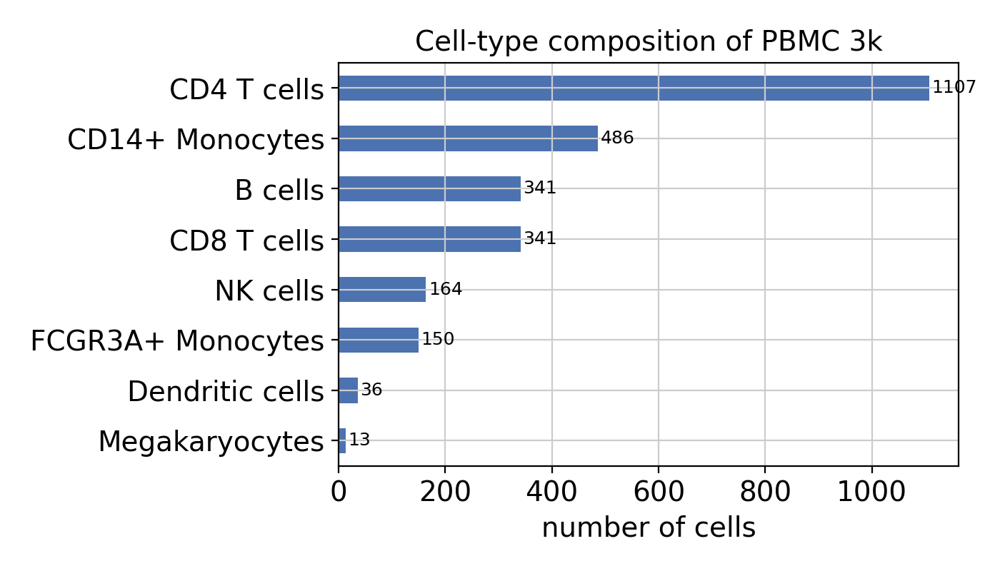

# Single-Cell RNA-seq of 2,700 PBMCs — From Raw Counts to Cell Types

[](https://www.python.org/)
[](https://scanpy.readthedocs.io/)
[](https://jupyter.org/)
[](LICENSE)

An end-to-end **single-cell RNA-sequencing (scRNA-seq)** analysis that takes the
raw, unlabelled gene-by-cell count matrix of **2,700 peripheral blood mononuclear
cells (PBMCs)** and — with no prior labels — recovers the major human immune
cell types and the marker genes that define them.

> Built with Python and [Scanpy](https://scanpy.readthedocs.io/). The full,
> annotated walkthrough lives in [`notebooks/pbmc3k_analysis.ipynb`](notebooks/pbmc3k_analysis.ipynb)
> (renders with all figures on GitHub), and a clean, modular pipeline lives in
> [`src/`](src/).

<p align="center">
  
</p>

---

## TL;DR — what the pipeline found

Starting from **2,700 cells × 32,738 genes**, after quality control (2,638 cells
retained) the analysis identified **8 transcriptionally distinct immune
populations** — exactly the composition expected of human blood:

| Cell type | Cells | Key markers used |
|---|---:|---|
| CD4 T cells | 1,107 | `IL7R`, `CD3D`, `CCR7` |
| CD14+ Monocytes | 486 | `CD14`, `LYZ`, `S100A8/9` |
| CD8 T cells | 341 | `CD8A`, `CD8B`, `GZMK` |
| B cells | 341 | `MS4A1`, `CD79A`, `CD79B` |
| NK cells | 164 | `GNLY`, `NKG7`, `KLRD1` |
| FCGR3A+ Monocytes | 150 | `FCGR3A`, `MS4A7` |
| Dendritic cells | 36 | `FCER1A`, `CST3` |
| Megakaryocytes | 13 | `PPBP`, `PF4` |

T cells dominate (as they do in real blood), and even the rare megakaryocyte
population — just 13 cells — was cleanly separated.

---

## Background

### Bulk vs. single-cell RNA-seq

**Bulk RNA-seq** measures the *average*
gene expression of a whole sample — all cells are ground up and pooled, so you
get one expression profile per sample. It answers *"how does this tissue's
expression change between conditions?"* but hides which **cell types** drive the
change.

**Single-cell RNA-seq** measures expression in **each individual cell**. Droplet
platforms like 10x Genomics encapsulate single cells in oil droplets, tag every
cell's transcripts with a unique **cell barcode** and every molecule with a
**UMI** (unique molecular identifier), then sequence everything together. The
result is a **genes × cells** count matrix that lets us discover and study cell
types directly. The cost is sparsity and noise: a typical cell has only a few
thousand of ~20,000 genes detected.

### The dataset

[**PBMC 3k**](https://www.10xgenomics.com/datasets) is the canonical teaching
dataset from 10x Genomics: **2,700 peripheral blood mononuclear cells** from a
healthy human donor (Chromium platform, hg19). PBMCs are exactly the immune cells
circulating in blood — T cells, B cells, NK cells, monocytes, dendritic cells —
which makes this dataset ideal: we know which cell types *should* appear, so we
can verify the analysis recovers the right biology.

---

## Repository structure

```
single-cell-rnaseq-pbmc3k/
├── README.md
├── LICENSE
├── requirements.txt              # pip dependencies
├── environment.yml               # conda alternative
├── Makefile                      # `make setup`, `make data`, `make run`
├── build_notebook.py             # regenerates the notebook from source
├── data/
│   ├── README.md                 # data provenance & licence
│   └── download_data.sh          # fetches the 10x PBMC 3k matrix
├── src/                          # the modular pipeline (importable package)
│   ├── config.py                 # every parameter & path in one place
│   ├── pipeline.py               # the analysis stages (QC, PCA, clustering, ...)
│   └── run_pipeline.py           # end-to-end driver: `python -m src.run_pipeline`
├── notebooks/
│   └── pbmc3k_analysis.ipynb     # narrated walkthrough with inline figures
├── figures/                      # all generated plots (committed)
└── results/                      # marker tables & cell-type counts (committed)
```

---

## Quickstart

> Tested on Ubuntu. Steps 1–2 install the toolkit; step 3 downloads the ~30 MB
> dataset; step 4 runs the whole analysis (~40 s on a laptop).

```bash
# 1. Clone
git clone https://github.com/IshanMaheshwari01/single-cell-rnaseq-pbmc3k.git
cd single-cell-rnaseq-pbmc3k

# 2. Install dependencies (pip)
python3 -m venv .venv && source .venv/bin/activate
pip install -r requirements.txt
#    …or with conda:
#    conda env create -f environment.yml && conda activate scrnaseq-pbmc3k

# 3. Download the data
bash data/download_data.sh

# 4a. Run the full pipeline (writes figures/ and results/)
python -m src.run_pipeline

# 4b. …or open the narrated notebook
jupyter lab notebooks/pbmc3k_analysis.ipynb
```

Everything is also available via the `Makefile`:

```bash
make setup   # pip install -r requirements.txt
make data    # bash data/download_data.sh
make run     # python -m src.run_pipeline
make notebook  # execute the notebook in place
```

---

## The pipeline, step by step

The workflow follows the community-standard scRNA-seq recipe. Each stage maps to
a function in [`src/pipeline.py`](src/pipeline.py) and a section of the
[notebook](notebooks/pbmc3k_analysis.ipynb).

### 1 · Quality control

A "cell" is really a droplet barcode, and not every barcode is a healthy single
cell. Three metrics separate good cells from bad:

- **genes per cell** — too few = empty droplet/debris; too many = a **doublet**
  (two cells in one droplet),
- **total counts (UMIs)** — sequencing depth,
- **% mitochondrial counts** — a high value flags a **stressed/dying cell** whose
  membrane ruptured and leaked cytoplasmic mRNA, leaving mostly mitochondrial reads.

We drop cells with `>2500` genes or `>5%` mitochondrial counts → **2,638 / 2,700
cells retained**.

<p align="center"></p>

### 2 · Normalisation & log-transform

Counts are scaled so every cell sums to 10,000 (CP10K), then `log(1+x)`
transformed. This removes the technical effect of sequencing depth and tames the
skew of expression values so a few high-count genes don't dominate.

### 3 · Highly variable genes

Most genes are uninformative housekeeping genes. We keep the **1,838 highly
variable genes** whose cell-to-cell variation exceeds technical noise — this
denoises the data and speeds everything up.

<p align="center"></p>

### 4 · Scaling & PCA

Genes are z-scored, technical covariates regressed out, then **PCA** compresses
the data into a handful of components capturing the real signal (the "elbow"
below). The top 40 PCs feed the next step.

<p align="center"></p>

### 5 · Graph, UMAP & Leiden clustering

A **k-nearest-neighbour graph** links each cell to its most similar cells in PCA
space. **UMAP** embeds that graph in 2-D for visualisation, and the **Leiden**
community-detection algorithm partitions it into clusters — **8 clusters** here.

<p align="center"></p>

### 6 · Marker genes

A one-vs-rest **Wilcoxon** test finds the genes most specifically up-regulated in
each cluster. The dotplot below confirms a clean, near-diagonal marker signature
(colour = mean expression, dot size = % of cells expressing).

<p align="center"></p>

### 7 · Annotation

Each cluster is matched to the cell type whose canonical markers it expresses
most strongly (data-driven, so it is robust to cluster re-numbering across Scanpy
versions). Overlaying single markers on the UMAP confirms each lights up exactly
one population:

<p align="center"></p>

---

## Results

The eight recovered populations and their abundances:

<p align="center"></p>

Full outputs are in [`results/`](results/):

- [`marker_genes.csv`](results/marker_genes.csv) — top 25 markers per cluster (log-fold-change, adjusted p-value, score)
- [`cluster_celltype_mapping.csv`](results/cluster_celltype_mapping.csv) — the annotation scores for every cluster × cell type
- [`celltype_counts.csv`](results/celltype_counts.csv) — cells per type
- `pbmc3k_processed.h5ad` — the fully processed, annotated object (regenerate with `make run`)

---

## Reproducibility

- A single random seed (`RANDOM_SEED = 0` in `src/config.py`) is used for PCA,
  the neighbour graph, UMAP and Leiden, so results are deterministic.
- All thresholds and parameters live in one file, `src/config.py`.
- Exact package versions used to produce these results: `scanpy 1.12.1`,
  `anndata 0.12.16`, `numpy 2.4.4`, `scipy 1.17.1`, `scikit-learn 1.8.0`,
  `leidenalg 0.12.0`, `python-igraph 1.0.0`, `umap-learn 0.5.12`, `numba 0.65.1`.

---

## Where to go next

This project covers the standard workflow; natural extensions include:

- **Doublet detection** with [Scrublet](https://github.com/swolock/scrublet) before clustering
- **Cell-cycle scoring** and regression to remove proliferation signal
- **Trajectory / pseudotime** analysis (PAGA, Diffusion Maps) for developmental data
- **Batch integration** across multiple donors ([Harmony](https://github.com/slowkow/harmonypy), [scVI](https://scvi-tools.org/))
- **Automated annotation** against a reference ([CellTypist](https://www.celltypist.org/))

---

## References

- Wolf, Angerer & Theis (2018). *SCANPY: large-scale single-cell gene expression data analysis.* **Genome Biology** 19:15.
- Traag, Waltman & van Eck (2019). *From Louvain to Leiden: guaranteeing well-connected communities.* **Scientific Reports** 9:5233.
- McInnes, Healy & Melville (2018). *UMAP: Uniform Manifold Approximation and Projection.* arXiv:1802.03426.
- 10x Genomics — PBMC 3k demonstration dataset.
- The analysis design follows the canonical [Scanpy PBMC 3k clustering tutorial](https://scanpy.readthedocs.io/en/stable/tutorials/basics/clustering-2017.html).

## License

Released under the [MIT License](LICENSE). The PBMC 3k data is provided by 10x
Genomics under their [dataset terms](https://www.10xgenomics.com/datasets).

---

*Author: [IshanMaheshwari01](https://github.com/IshanMaheshwari01) · A follow-up
to my bulk RNA-seq analysis project, extending the workflow to the single-cell level.*
